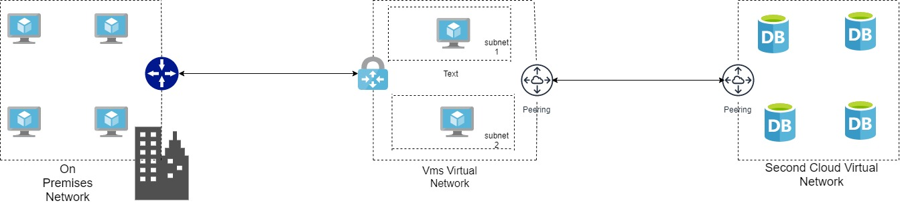

# azure-migration-blueprints

This repo has the goal to show how to create azure blueprints to help in the
migration process of several VM's to the cloud, including CI/CD best practices
for Azure DevOps using azure pipelines.

## Azure Blueprints

Azure Blueprints are a way of deploying environments to Azure using infrastructure as
code. With that, you can create resource groups, apply policies and create ARM resources
to deploy your environments. Basically, it helps organize all your ARM templates inside
only one solution. To know more about Blueprints, go to this 
[link](https://docs.microsoft.com/en-us/azure/governance/blueprints/overview) and
start exploring all our documentation about this resource.

## Scripts

Inside the scripts folder, we have all the scripts that are used to deploy the blueprint
resources to the desired subscription. Each script has the responsabilitie for:

- **authorizeOnPipeline.ps1:** this script authorizes the Service Principal you created
against Azure, in order to perform desired actions.
Note: you will need to give permissions of read and write blueprints and role assignments
to the Service Principal you created.
- **installPrerequisites.ps1:** to perform the actions with blueprints, you need to
install some libraries, and this is what this script does.
- **publishAndAssign.ps1:** there are several steps to publish and deploy a blueprint,
this script take care of all of them.

    - Import-AzBlueprintWithArtifact: creates the blueprint as draft.
    - Publish-AzBlueprint: publish a version of the blueprint.
    - New-AzBlueprintAssignment: assign the blueprint, which means that it
    puts values to the parameters and deploy the resources.

## Azure pipeline

The ```azure-pipelines.yaml``` file is responsible for setting the Azure Devops pipeline,
in case you are using Azure DevOps. What it does is running several scripts for
installing dependencies, authoring the agent agains Azure DevOps, createing a blueprint
and assigning it. The parts of the code that need some attention are:

- **trigger:** this section tells what will trigger the pipeline. In this case, pushes
to the master branch.
- **variables:** tell which library will be used in the pipelies. You can define group
variables in Azure DevOps, and then acees them by using the ```$()``` expression in the
pipeline.
- **pool:** defines which type of machine you will run your builds. In this case, the
latest image of ubuntu.
- **steps:** this is the part where you really define the steps for the build pipeline.
Here, we are using only powershell script steps.

## Sample Bluesprint

The sample blueprint tries to simulate a situation that an enterprise is migrating several
vms from the on premises to the cloud. So, in this case the resources we have are:

- Several copies of VMs on the cloud
- Local and cloud gateway in order to create a vpn connection between the on premises and
the cloud
- An external cloud VNET that is peered with the VMs VNET.
- The VNET that is has a vpn connection with the on premises, has several subnets, one for
the gateway, one for the VMs, for example.

Below is the design of this archtecture:

